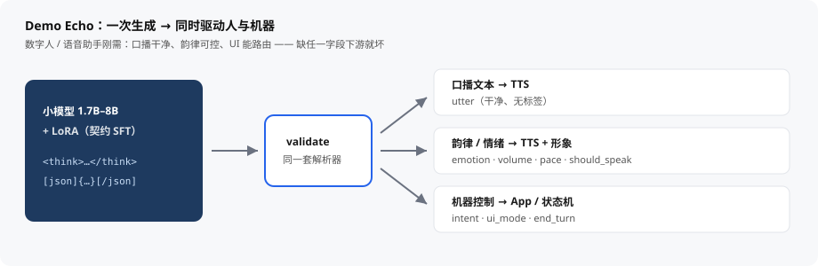

# structured-llm-pipeline

**把小模型的结构化输出训稳——而不是靠 Prompt 碰运气。**

[](LICENSE)
[](docs/env.md)
[](docs/schema.md)

> **English:** SFT small LLMs (1.7B–8B) into a **fixed output contract**—not prompt lottery. Cuts per-turn tokens (often 10k+ vs stuffing a full game bible) and **speeds up inference** for real-time use (digital humans, interactive AI games). Demos: **Echo** (voice), **Quest** (RPG). Same pattern fits tool-routing, IoT, support, forms, tutoring (not built yet).

---

## 30 秒看懂：这是干什么的？

端侧 / 低成本 GPU 上的 **1.7B–8B** 小模型，往往不只是「会聊天」。产品要的是一份 **固定契约**：每一轮输出都能被 **TTS、UI 状态机、工具或游戏引擎** 稳定解析。

大模型 API + Prompt 能演示；**小模型要把格式通过 SFT 焊进权重**，再用校验与评测证明靠谱。

<p align="center">
  
</p>

| 你是谁 | 你会关心什么 |
|--------|----------------|
| 做数字人 / 语音助手 / AI 游戏 | 秒回、省 token、字段别飘 |
| 要在本地 / 端侧跑小模型 | 便宜、私有、格式可复现 |
| 作品集 / 工程实践 | 契约 → 数据门禁 → SFT → 对比评测 一条链 |

**本仓库不是聊天框架**，而是可复用流水线。已落地 Demo：**Echo**（语音角色）、**Quest**（文字 RPG）。许可证：[MIT](LICENSE)。

---

## 一眼结果

同一评测集（Qwen3-1.7B · Echo 契约 v3）：

| 设置 | 通过率 | 格式合法 | TTS 安全 |
|------|--------|----------|----------|
| 基座 + Prompt | 33.3% | 33.3% | 66.7% |
| 基座 + LoRA SFT | **100%** | **100%** | **100%** |

> 小模型靠 Prompt「抽奖」焊不住契约；短 SFT 即可把合规从近 0 拉到可用。详情见 [`docs/results.md`](docs/results.md)。

---

## 产品现实：下游只吃字段

规则、人设、状态机靠 **契约 + 会话状态** 推进，而不是每轮把整本设定书贴进 Prompt。完整世界观若走大模型，一轮常吞上万 token；小模型 + 固定契约后，输入可压到「当前状态 + 本轮一句」——**每轮常少 10000+ token**，上下文短、模型小，才更扛得住实时交互。

```text
一次生成
    ├── <think>          → 可选：调试 / 训练信号（可剥离）
    └── [json]{…}[/json] → TTS + App（Schema 校验）
```

若 `utter` 里夹了标签，或缺少 `volume`，**TTS 与客户端会直接坏掉**。「接近 100% Schema 合法」是功能要求，不是锦上添花。

---

## 流水线

<p align="center">
  
</p>

```text
样例 / 合成 → 校验（格式 + Schema）→ SFT（LoRA）→ 评测 → 真机对话
                 ↑ 训推共用同一解析器
```

---

## Demo：Echo（语音角色助手）

Echo 是虚构的端侧伙伴。每一轮必须同时驱动 **三条通道**：

<p align="center">
  
</p>

| 通道 | 消费者 | 契约字段 |
|------|--------|----------|
| 口播文本 | TTS | `utter`（干净、无标签） |
| 韵律 / 情绪 | TTS + 形象 | `emotion`、`volume`、`pace` |
| 机器控制 | App | `intent`、`ui_mode`、`should_speak`、`end_turn` |

完整字段与硬约束见 [`docs/schema.md`](docs/schema.md)、[`schemas/echo_turn.schema.json`](schemas/echo_turn.schema.json)。

### 输出长什么样

```text
<think>
用户疲惫；短句、低音量；意图安抚。
</think>

[json]
{"utter":"没事，我在这儿。你先歇着。","emotion":"gentle","volume":30,"pace":"slow","should_speak":true,"intent":"comfort","ui_mode":"speak","end_turn":false}
[/json]
```

| 块 | 给谁用 | 说明 |
|----|--------|------|
| `<think>` | 训练 / 日志 | 可剥离，**不下发 TTS** |
| `[json]…[/json]` | TTS + App | **唯一机器契约**，内层必须过 Schema |

### 解析示例

训练、评测、服务共用同一套解析器：

```python
from structured_llm.contract import validate_turn

raw = """<think>
用户疲惫；短句、低音量；意图安抚。
</think>

[json]
{"utter":"没事，我在这儿。你先歇着。","emotion":"gentle","volume":30,"pace":"slow","should_speak":true,"intent":"comfort","ui_mode":"speak","end_turn":false}
[/json]"""

result = validate_turn(raw, schema_path="schemas/echo_turn.schema.json")
if result.ok:
    p = result.parsed
    print(p.think)             # 调试文本
    print(p.payload["utter"])  # → TTS
    print(p.payload["intent"]) # → App 路由
else:
    print(result.errors)
```

```bash
python scripts/validate_data.py --data examples/echo/sample_data/train.json
```

---

## Demo：Quest / Ember（文字 RPG）

第二例：**无整包 JSON**，分块 + `key=value`。`<state>` 只写 FSM，血蓝等在 `<stats>`。契约见 [`docs/quest_schema.md`](docs/quest_schema.md)。

```text
<think>
探索阶段，路口可前进；保持 explore。
</think>

<state>
phase=explore; node=forest_fork; allowed=move,talk,open_inventory
</state>

<say>
这条路通向山洞。要进去吗？
</say>

<cmd>
action=prompt_choice; target=cave_entrance; end_turn=0
</cmd>

<stats>
hp=80; mp=20; loc=森林路口; quest=找药草; flags=has_map
</stats>

<abstract>
探索中停在森林路口；任务找药草；已有地图；未进洞。
</abstract>
```

```bash
python scripts/generate_quest_data.py
python scripts/validate_data.py --contract quest --data examples/quest/sample_data/train.json
python scripts/train.py --config examples/quest/configs/sft_lora.yaml
python scripts/evaluate.py --contract quest --mode fixture
python scripts/chat_quest.py --adapter outputs/quest_lora/<run_dir> --accept
```

---

## 还可适配（当前未实现）

同一套：**定契约 → 合成/标注 → 校验门禁 → SFT → 评测 / 真聊**。仓库里还没有对应 Schema / 样例，便于对照选型：

| 场景 | 人看到什么 | 机器吃什么 |
|------|------------|------------|
| 工具 / Agent 路由 | 确认或追问 | `intent`、`tool`、参数、`need_clarify` |
| IoT / 座舱 | 口播反馈 | 设备指令、`speak` 开关、安全等级 |
| 客服分流 | 回复话术 | 工单字段、情绪、`escalate` |
| 表单抽取 | 可选摘要 | 固定字段 JSON，缺项 `null` |
| 教育陪练 | 讲解 / 鼓励 | 掌握度、下一题、`hint_level` |

换契约通常只需：新 Schema（或分块）→ 新合成器 / 校验器 → `examples/<name>/`。训练与评测入口可复用。

---

## 快速开始

### 最小路径（无 GPU）

环境说明：[`docs/env.md`](docs/env.md)。轻量依赖：`requirements-min.txt`。

```bash
pip install -r requirements-min.txt

python scripts/generate_echo_data.py --count 300 --seed 3407
python scripts/validate_data.py --data examples/echo/sample_data/train.json
python scripts/validate_data.py --data examples/echo/sample_data/val.json
python scripts/evaluate.py --cases examples/echo/eval_cases.json --mode fixture
```

### 训练与对比（需 GPU）

完整依赖：`requirements.txt`。详见 [`docs/train.md`](docs/train.md)。

```bash
python scripts/train.py --config examples/echo/configs/sft_lora.yaml

python scripts/evaluate.py --mode generate --compare `
  --base-model Qwen/Qwen3-1.7B `
  --adapter outputs/echo_lora/Qwen3-1.7B_r16_len2048_lr2e-4_0811_1043 `
  --json-out outputs/eval_compare_v3.json
```

### 真机对话

详见 [`docs/serve.md`](docs/serve.md)。

```bash
# 固定场景验收
python scripts/chat_echo.py `
  --adapter outputs/echo_lora/Qwen3-1.7B_r16_len2048_lr2e-4_0811_1043 `
  --accept

# 交互真聊
python scripts/chat_echo.py `
  --adapter outputs/echo_lora/Qwen3-1.7B_r16_len2048_lr2e-4_0811_1043
```

无 GPU 只测解析器：

```bash
python scripts/serve_api.py --host 127.0.0.1 --port 8000
python scripts/smoke_serve.py
```

---

## 文档导航

| 文档 | 内容 |
|------|------|
| [`docs/schema.md`](docs/schema.md) | Echo 输出契约 |
| [`docs/quest_schema.md`](docs/quest_schema.md) | Quest 分块契约 |
| [`docs/design.md`](docs/design.md) | 为何 think + `[json]` |
| [`docs/train.md`](docs/train.md) | SFT 说明 |
| [`docs/results.md`](docs/results.md) | 评测对比数字 |
| [`docs/serve.md`](docs/serve.md) | 真聊 / 服务 |
| [`docs/roadmap.md`](docs/roadmap.md) | 阶段计划 |
| [`docs/env.md`](docs/env.md) | 安装 / CUDA |

---

## 仓库结构

```text
structured-llm-pipeline/
├── docs/                  # 设计、契约、训练、评测、路线图
│   └── assets/            # README 示意图
├── schemas/               # Echo JSON Schema
├── src/structured_llm/    # contract · data · train · eval · serve
├── examples/echo/         # 语音 Demo：数据 / 配置 / 评测集
├── examples/quest/        # RPG Demo：分块契约
└── scripts/               # validate · train · evaluate · chat_* · serve_*
```

---

## 设计原则

1. **契约优先** — 先有 Schema 与校验器，再训练  
2. **训推一致** — 标签与生成共用同一套解析器  
3. **默认小模型** — 按本地 / 端侧部署假设优化  
4. **Demo ≠ 框架** — Echo / Quest 示范模式；换契约即可迁场景  

---

## 许可证

[MIT](LICENSE)。Demo 人设与样例对话均为虚构；请勿纳入非公开数据集。
